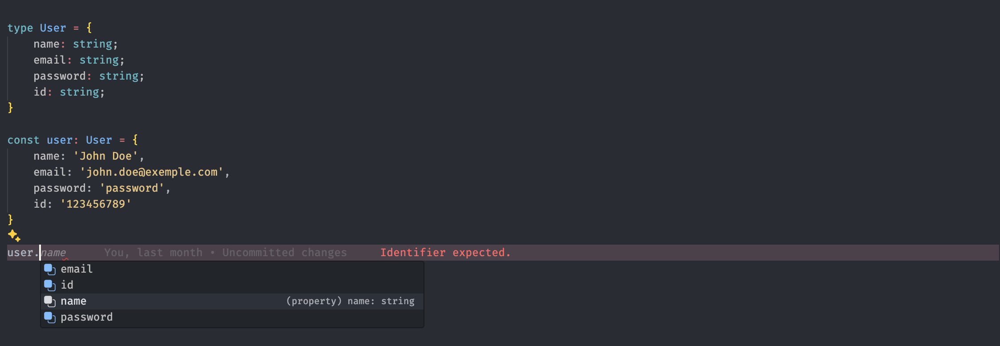

### Introduction à TypeScript

#### **Objectifs :**
- Comprendre les concepts de base de TypeScript et ses avantages par rapport à JavaScript.
- Apprendre à utiliser TypeScript pour améliorer la qualité du code avec l’auto-complétion dans VSCode.

---

#### **1. Qu'est-ce que TypeScript ?**

TypeScript est un sur-ensemble de JavaScript qui ajoute la **vérification de types** statique et des **fonctionnalités modernes**. Cela signifie que tout code JavaScript valide est aussi du TypeScript, mais avec TypeScript, vous pouvez définir des types pour vos variables, fonctions, objets, etc. Cela permet de réduire les erreurs de code en les détectant à l’avance, lors de l’écriture du code, plutôt qu'à l'exécution.

**Avantages de TypeScript :**
- **Vérification des types à la compilation** : Vous savez si vous faites une erreur avant même d'exécuter le code.
- **Auto-complétion dans VSCode** : Grâce à la vérification de types, VSCode peut suggérer des méthodes, propriétés et types pendant que vous codez, ce qui améliore la productivité.
- **Maintenance facile** : TypeScript rend le code plus lisible et plus maintenable, surtout dans les grands projets.

---

#### **2. Types de base en TypeScript**

Voici les types les plus courants que vous utiliserez dans TypeScript :

- **`string`** : Chaîne de caractères.
- **`number`** : Nombre (entier ou flottant).
- **`boolean`** : Valeur booléenne (`true` ou `false`).
- **`any`** : Peut être de n'importe quel type (utile pour désactiver temporairement la vérification de type).
- **`array`** : Tableau de valeurs, typé comme `string[]` pour un tableau de chaînes.

**Exemple :**
```typescript
let username: string = "Alice";
let age: number = 25;
let isActive: boolean = true;

let hobbies: string[] = ["Lecture", "Sport"];
```

---

#### **3. Fonctions avec TypeScript**

Les types peuvent aussi être utilisés dans les fonctions pour les paramètres et le type de retour.

**Exemple :**
```typescript
function greet(name: string): string {
  return `Bonjour, ${name}!`;
}

console.log(greet("Alice"));
```

Dans cet exemple, `name` doit être de type `string` et la fonction retourne également une chaîne de caractères.

---

#### **4. Interfaces et Objets en TypeScript**

Les interfaces permettent de définir la structure des objets, ce qui permet à TypeScript de vérifier que les objets ont bien les bonnes propriétés et types.

**Exemple :**
```typescript
interface User {
  id: number;
  name: string;
  email: string;
}

const user: User = {
  id: 1,
  name: "Alice",
  email: "alice@example.com"
};

console.log(user.name); // Alice
```

**Avantage dans VSCode :**
- Grâce à l’interface `User`, VSCode peut vous suggérer automatiquement les propriétés `id`, `name`, et `email` lorsque vous travaillez avec l'objet `user`.

---

#### **5. Classes en TypeScript**

TypeScript supporte également les classes, avec des types pour les attributs et méthodes.

**Exemple :**
```typescript
class Person {
  name: string;
  age: number;

  constructor(name: string, age: number) {
    this.name = name;
    this.age = age;
  }

  greet(): string {
    return `Bonjour, je suis ${this.name}, et j'ai ${this.age} ans.`;
  }
}

const person = new Person("Bob", 30);
console.log(person.greet());
```

Avec TypeScript, VSCode peut proposer automatiquement les méthodes et attributs disponibles lorsque vous travaillez avec une instance de `Person`.

---

#### **6. Auto-complétion avec VSCode**

L’un des grands avantages de TypeScript est l’**auto-complétion** dans VSCode. Grâce à la vérification des types, VSCode peut suggérer automatiquement des méthodes, des propriétés, et des types pendant que vous tapez du code.

**Exemple pratique dans VSCode :**
Lorsque vous définissez un objet ou appelez une fonction, VSCode vous proposera automatiquement les noms de propriétés et de méthodes correspondants aux types que vous avez définis. Cela permet non seulement d’écrire du code plus rapidement, mais aussi de réduire les erreurs.



---

#### **7. Conclusion**

TypeScript est un outil puissant qui améliore la qualité du code JavaScript en ajoutant la vérification des types, ce qui permet de détecter les erreurs avant l'exécution. Combiné à l'auto-complétion dans VSCode, il augmente considérablement la productivité des développeurs en leur fournissant des suggestions intelligentes basées sur les types.